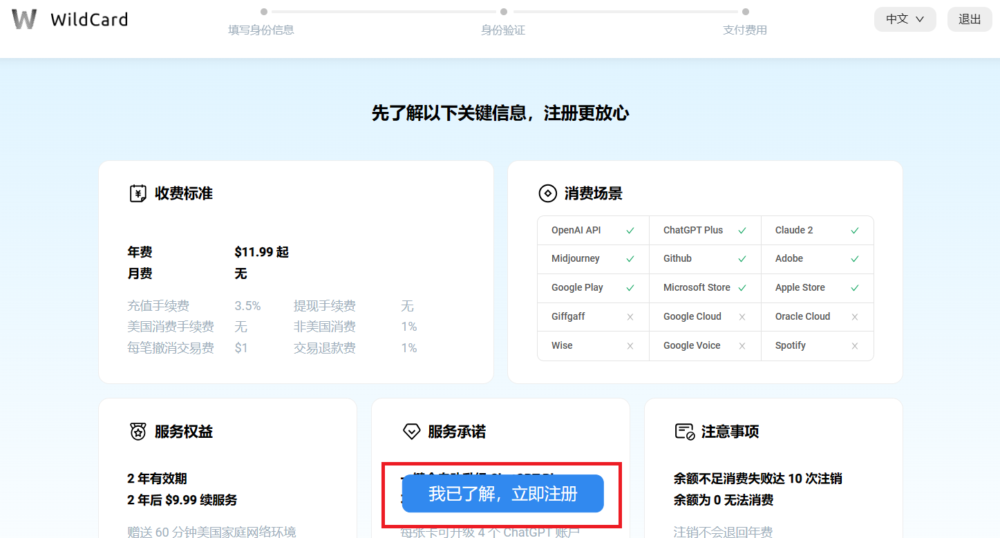

##  【重点】升级前提与所需成本

**前提** ：1.拥有自己的ChatGPT账号，如你还没有自己的独享账号，可以看这篇文章[【保姆级教程】2024年2月最新，怎么注册ChatGPT，手把手教你新手小白都能学会](https://txccai.github.io/gptDocs/chatGPT/how-to-register-gpt.html)。2.开通WildCard平台。（ps:不了解该平台可以看这篇文章[WildCard虚拟信用卡是什么？WildCard平台可以干什么？它安全吗？](https://txccai.github.io/gptDocs/WildCard/something-about-wildcard.html)）

WildCard一键升级ChatGPT Plus(4.0)顺序如下:

1. 使用[WildCard专注于为国内提供海外服务的虚拟信用卡平台](https://bewildcard.com/i/GTP999)开通虚拟信用卡。（ps:从此链接进入平台组成可以优惠2美元，也就是14多rmb，省下一杯奶茶钱。你也可以输入邀请码GTP999也可以得到同等优惠）

2. 开卡后，进入[Wildcard首页]((https://bewildcard.com/i/GTP999))，点击“我的服务”，点击 **“ChatGPT Plus/Team一键升级”的进入按钮**，然后按照平台教程进行开通即可。

总费用：WildCard开卡费9.9美元(开卡后将拥有1年的使用时间，平均一天也就差不多2毛)+GPT订阅费用（20美元），共计人民币约220多元（ps:当然汇率会变化，大家可以在开通之前去查一查）

全程使用支付宝支付，安全快捷。下面将给出图文教程，方便大家操作。

## 一、首先开通WildCard平台

进入**[Wildcard首页]((https://bewildcard.com/i/GTP999))**,点击页面上的立即注册

然后点击“我已知晓，立即注册”

接着输入你的手机号接收验证码（使用邀请码GTP999可以在开卡时优惠2美元,大概14多rmb,大家可以查汇率计算）

然后填写你的个人信息(个人信息和下一步的支付宝扫码认证，是为了防止洗钱，是一种安全保护措施)

点击下一步，进行支付宝扫码认证（不需要人脸或身份证）

支付宝认证完之后，选择卡片开通的时长（根据个人需要选择）。此外，如果你是从上面的链接进入或填写了邀请码GTP999，可以得到2美金优惠。支付之后等待几分钟时间，就开通成功了。

## 二、升级ChatGPT Plus

等到开卡成功之后，进入我的服务页面，选择 **一键升级ChatGPT服务** 进入。

这里千万要注意，使用微软邮箱有极高**封号**危险，也就是使用outlook.com、hotmail、live.cn邮箱注册的gpt账号。

最后按照平台的官方步骤，就可以订阅到ChatGPT Plus(4.0)了。

最后恭喜你获得了自己的Plus账号，当然如果你觉得有点麻烦，但还是想要一个账号，可点击下面链接。

[获取你的ChatGPT](https://txccai.github.io/gptDocs/chatGPT/how-to-buy-gpt.html)