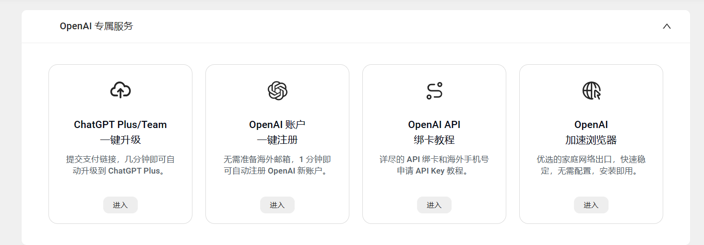

## WildCard虚拟信用卡是什么？WildCard平台可以干什么？它安全吗？

### 1.虚拟信用卡是什么

虚拟信用卡是一种**数字化的信用卡**，其信息存在于电子形式而非实体卡片上。虚拟信用卡通常用于**在线购物、数字支付**和其他电子交易，其目的是提供一种更安全、方便的支付方式。虚拟信用卡可以被限制在特定商户、特定金额范围或特定时间内使用，提供更细致的控制。 虚拟信用卡主要设计用于在线购物和数字支付，为互联网上的交易提供更安全的方式。虚拟信用卡的主要优势之一是安全性。由于虚拟信用卡是临时的，用户可以根据需要创建和销毁虚拟卡号，从而降低了被盗用卡号的风险。此外，虚拟信用卡通常还提供限制额度和有效期等额外的安全措施。

### 2.WildCard平台是什么

WildCard是一家专注于提供虚拟信用卡服务，专为国内用户提供便捷的海外在线服务订阅体验的公司。WildCard本质上也是一种虚拟信用卡，用户需要向里面充值后才能使用平台提供的相关服务。类似的 还有 depay、onekey 等。通过使用WildCard虚拟信用卡，国内用户可以绕过国内信用卡无法订阅的限制，轻松开通服务。WildCard算是为 OpenAI 量身定制的虚拟信用卡解决方案。不仅如此，Apple Store 美区，OpenAI API 账单，ChatGPT Plus 等订阅都没问题，还可以申请用于接收短信验证码的临时海外手机号，方便注册海外服务。

**优势**

1. 不同于 depay、onekey等平台 仅能支持 USDT 入金，Wildcard 支持支付宝消费，免去购币过程。
2. 提供美国账单地址，使用在美国的家庭 IP，方便订阅美区服务。
3. 可将多充值的消费剩余实时提现到支付宝。
4. UI界面简洁，对小白友好。当然如果你对于操作有些疑惑。我后面会出相关的操作教程并附上链接。

下面是该平台一部分相关服务，大家如果感兴趣可先通过链接去看看再考虑自己需不需要，毕竟虚拟信用卡是被限制在特定商户、特定金额范围或特定时间内使用，这也是为了安全性考虑。

如果你想试试或者有相关需要，可以通过我的邀请链接即可注册，此外通过我的**邀请码（GTP999**）注册还可以减去2美元也就是差不多14元的优惠，省下一杯奶茶钱（当然如果你喝的是蜜雪就不只2杯了）。 [ 立即注册Wildcard体验](https://bewildcard.com/i/GTP999)  通过此链接也可达到同样的优惠。

### 3.安全性如何

任何东西对于我们来说，安全性是应该重点考虑的。正如上面所说，WildCard本质上还是一个虚拟信用卡，而虚拟信用卡的主要优势之一是安全性。由于虚拟信用卡是临时的，用户可以根据需要创建和销毁虚拟卡号，从而降低了被盗用卡号的风险。此外，虚拟信用卡通常还提供限制额度和有效期等额外的安全措施。且为了顺利绑定/付款并提高交易成功率，WildCard 提供了**免费的美国家庭网络环境**，每位充值客户可以免费使用两个 Session，每个 Session 可使用半小时。这样的浏览器环境会在使用后**自动销毁**，保护您的隐私。 

::: tip
最后打扰一下，如需代注册帐号或代充值Chatgpt Plus会员，请添加站长客服微信：a3148856044,备注gpt
:::

