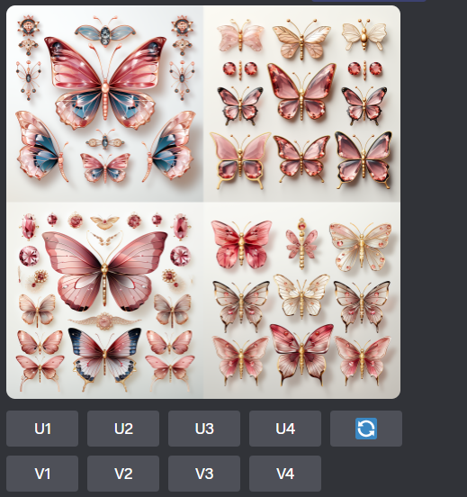
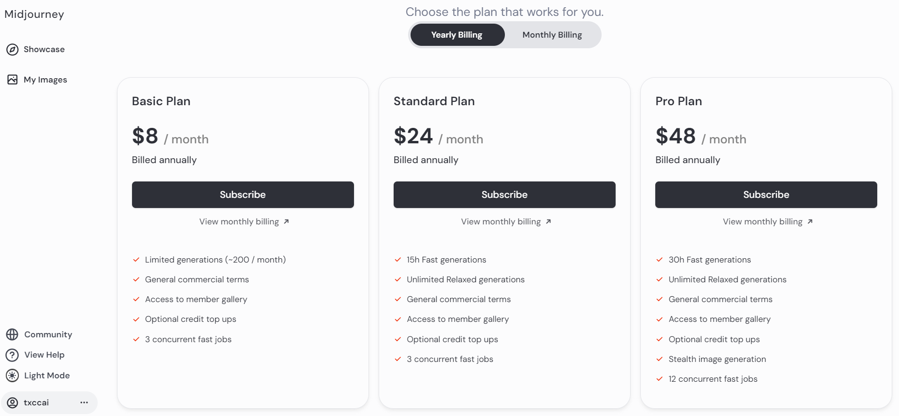
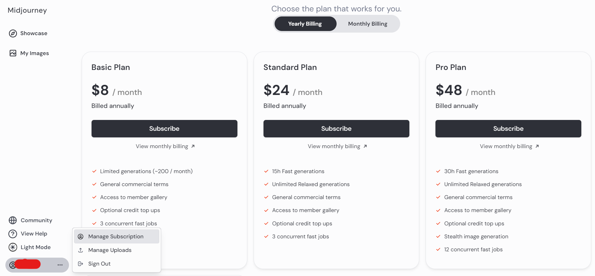
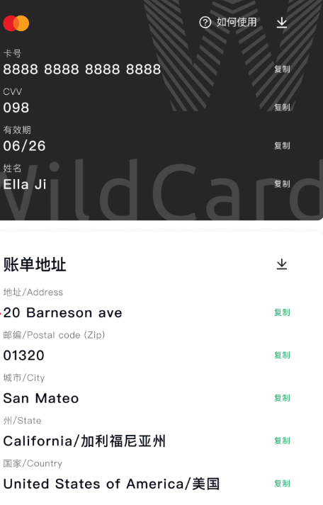

## midjourney介绍

数字新时代，AI崭露头角，引领各个领域的风潮！尤其是在艺术和设计的殿堂，AI的引入成为瞩目焦点。Midjourney，作为一款炙手可热的AI绘画软件，以其独特的科技原理和极简易用的界面，为创作者们打造了一个崭新的创作天地，助力塑造逼真绘画杰作。

Midjourney，是Midjourney研究实验室精心打造的一款先进人工智能程序，傲视群雄！它凭借独特的技术原理，能够根据用户的文字输入，瞬间绘制出精美绝伦的图像。Midjourney的核心机制在于通过深度算法解析海量作品数据，汲取灵感，使其能够根据关键词生成多样化的图像，包括卡通、风景、人物等等。

走在数字革命的前沿，Midjourney以先进科技为后盾，引领艺术和设计领域的创新潮流。这一热门AI绘画软件不仅让创作过程更加直观，还通过独特的技术原理，为用户提供了极为畅快的创作平台。

这款AI艺术大师，借助先进的算法，将用户的想象力昇华为绚丽多彩的视觉奇迹。而且，Midjourney独创的图片指令功能更是让用户在生成的图像上随心调整和优化，创造出更加完美的艺术品。

## midjourney使用教程

### 第1步：加入 Discord 并开放新手频道

你必须首先加入 Midjourney 的官方 Discord 频道。继续从左侧进入新手部分，并在提供的消息空间中键入“/”以打开命令列表。

### 第2步：选择创建 AI 图像的命令

继续从列表中选择“/imagine”命令，然后键入要从中创建图像的文本提示。编写文本提示后，继续输入详细信息并将其发送给机器人。

### 第3步：升级或更改图像模型版本

AI机器人将创建的图像返回到频道中。观察图像，并可以点击图像下方的可用按钮来升级或更改图像的模型版本。

### 第4步：在浏览器中打开图像

要保存图像，请单击它以在新屏幕上打开它。选择“在浏览器中打开”按钮以打开一个新窗口。

### 第5步：将图像保存到设备

当图像在浏览器中打开时，右键单击选择“将图像另存为...”选项以继续将图像下载到计算机上。

## 怎么快速简单在国内订阅midjourney

提示：Midjourney是一款卓越的创作工具，为你带来前所未有的艺术体验。然而在这个知识付费的时代，为了提供更多强大的功能和服务，我们需要进行付费订阅。这将确保你在创作过程中享受到最优质的体验，同时支持Midjourney团队不断创新和改进。

midjourney的订阅需要绑定国外的信用卡，原来还可以支付宝支付，现在好像不行了，所以在国内我们就需要用到虚拟信用卡。小编在这里用到的是[WildCard专注于为国内提供海外服务的虚拟信用卡平台](https://bewildcard.com/i/GTP999)，需要开卡费9.9$一年，相比其他平台它界面简洁，操作简单，而且用支付宝支付即可，而且还提供其他服务，例如：chatgpt4的升级，onlyfans订阅。(ps:如果你对这些管兴趣，可以看最下方的相关文章)

[wildcard开卡教程，在此文第一部分](https://txccai.github.io/gptDocs/WildCard/)

[midjourney官网首页](https://www.midjourney.com/)

### 1.登录

在科学上网的前提下进入 Discord 官方网址 [https://discord.com/login ](https://discord.com/login )

登录成功后，你将看到如下界面：

### 2.登录 Midjourney 进行订阅

登录 Discord 成功后，就可以登录 Midjourney 进行订阅了。在浏览器的地址栏输入 https://www.midjourney.com/login/ 
在弹出的 Discord 页面点击授权，就可以登录 Midjourney 了。
[Discord授权Midjourney](https://downloads.intercomcdn.com/i/o/774755950/5d248224c4d07b6a4dfaaebf/%E6%88%AA%E5%B1%8F2023-06-30+11.50.27.png)

点击左边栏的 「个人头像」Manage Subscription，即可选择套餐进行订阅

点击 「Subscribe」，在弹出的绑定支付页面，依次输入卡号、有效月份/年份、CVC（即您的 CVV ）、美国的账单地址及姓名便可成功绑定。

## 相关文章：

[wildcard怎么订阅chatgpt4](https://txccai.github.io/gptDocs/WildCard/)

[WildCard虚拟信用卡是什么？WildCard平台可以干什么？它安全吗？](https://txccai.github.io/gptDocs/WildCard/something-about-wildcard.html)