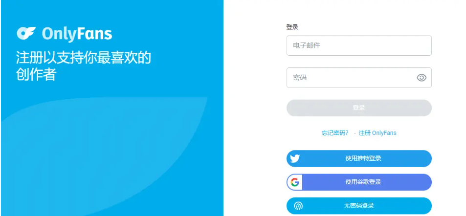
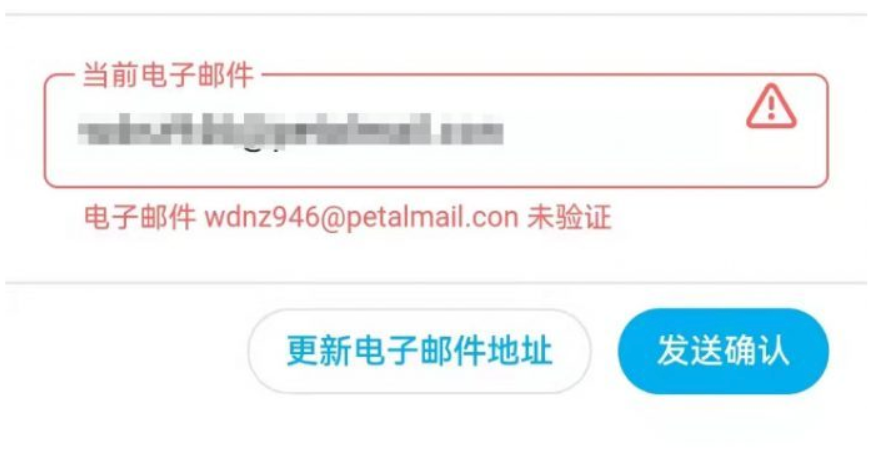
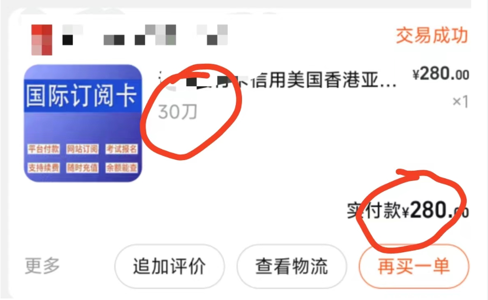
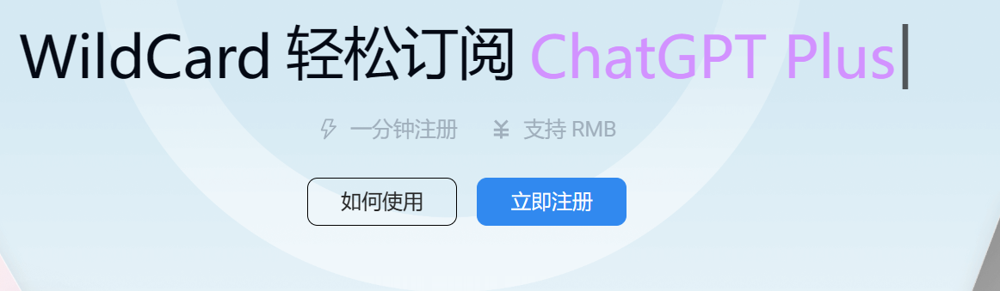
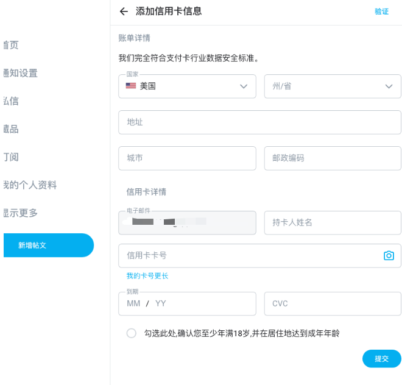
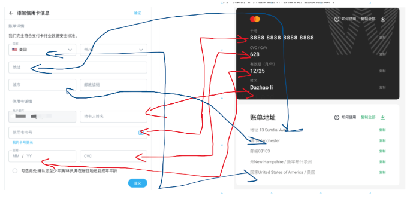
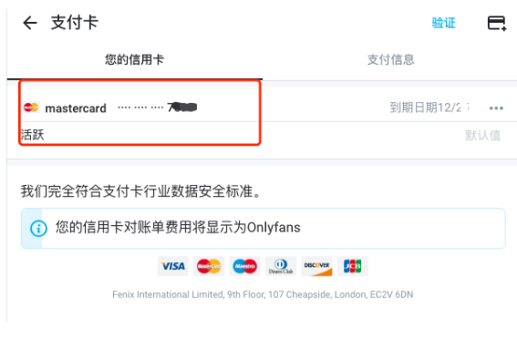
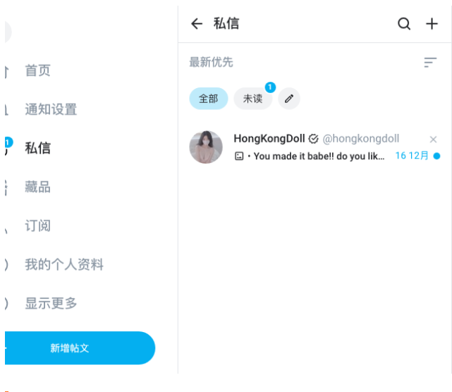

## onlyfans是什么

根据维基百科记载，OnlyFans是一个总部位于英国伦敦的社群媒体，该平台鼓励创作者与其订阅者进行交互、创建关系、推出付费内容以获取收益。该平台在成人产业中相当受欢迎，此外亦有健身、烹饪等内容。简单来说，onlyfans在一定程度上相对于国内的小红书微博等平台，本质上都是分享创作者生活和作为创作则的创作平台。不过onlyfans平台实现了订阅制度，只有用户订阅了某个博主，用户才可以收看到该博主发布的各类作品。但是订阅需要门票，而门票是由创作者自己设定为自己满意的价格的，可以免费，也可以收费，收费的话就得4.99刀起。

那它为什么会慢慢变得热门了，甚至超过了p站。这就不得不提取这个平台的管理非常宽松，导致其他平台例如：p站推特蓝鸟等等怕热不怕冷的敏感女菩萨纷纷寻声前来。本来就放的开的女菩萨们为了经济发展，被经济所带动，只要用户付费订阅就可以给她发消息康好康的。

## 国内怎么付费订阅onlyfans

onlyfans需要绑定信用卡才能进行订阅消费，可它不支持国内的信用卡。那我们就需要使用特殊的虚拟信用卡进行绑定订阅。这里比较推荐[Wilcard这个平台](https://bewildcard.com/i/GTP999)，它的界面ui简单，相比其他平台，对小白新手非常友好。当然你可以通过此链接[WildCard虚拟卡是什么？](https://txccai.github.io/gptDocs/WildCard/something-about-wildcard.html)进行了解。

下面小编将图文并茂的给大家展示一下onlyfans创造平台的虚拟订阅卡订阅教程。

（PS：本文教程完全目前可用，可以放心食用~）

## 一、注册onlyfans

**onlyfans官方地址：**[https://onlyfans.com/](https://onlyfans.com/)

### 1.使用国内邮箱qq等邮箱即可注册

### 2.邮箱验证
确认邮箱地址正确后，点击发送确认，后面我们将通过填写的邮箱收到onlyfans的官方邮件，接着将收到的链接在登录的浏览器里复制粘贴打开即可验证成功。

## 二、支付订阅

**注意：不建议大家去某宝去购买，贵且是一次性消耗品。**

小编踩过坑，有图有真相。

### 推荐长期安全的虚拟卡平台

[https://bewildcard.com/i/GTP999](https://bewildcard.com/i/GTP999)( 使用这个链接复制到浏览器打开，2分钟即可搞定开卡，还可享受减免15rmb优惠~)

可以选择开卡有效期1年或者2年，**最高两年**开卡费也只有**100元左右**，后续每次消费只需要充值你需要的美元金额即可，用支付宝充值即可，直接虚拟卡就能支付入账，非常方便，冲多了还可以提现回来。

## 三、开卡之后，如何用此虚拟卡进行订阅

第一步：向卡里充如你想要订阅博主付费内容需要的金额即可（这里建议多充1-2刀乐，防止扣款失败）

然后去onlyfans绑定虚拟卡，[https://onlyfans.com/my/payments/add_card](https://onlyfans.com/my/payments/add_card)：

这上面所要的每条信息项，都可以在虚拟卡平台上一一对应找到，直接复制粘贴就行了：

绑定虚拟信用卡后，就可以用此卡去付费订阅自己喜欢很久的博主啦！是不是非常快捷简单。

:::tip
如果你还有其他想了解的信息可以在此站搜索，看看有没有文章能帮助到你
:::